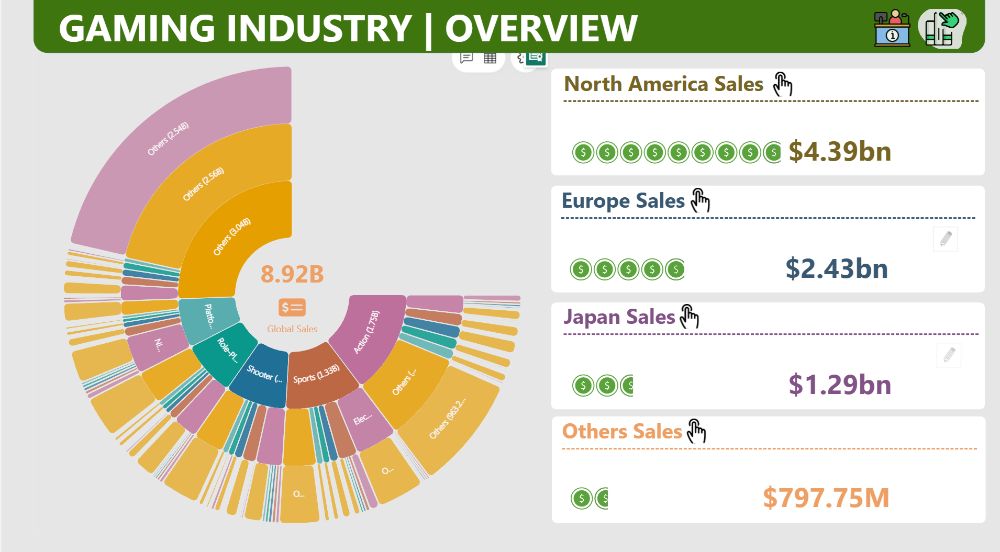
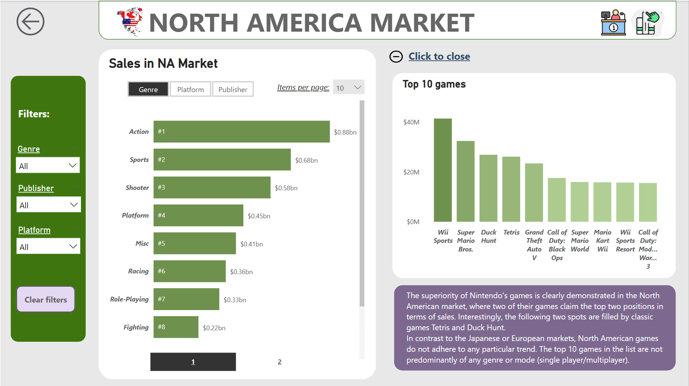
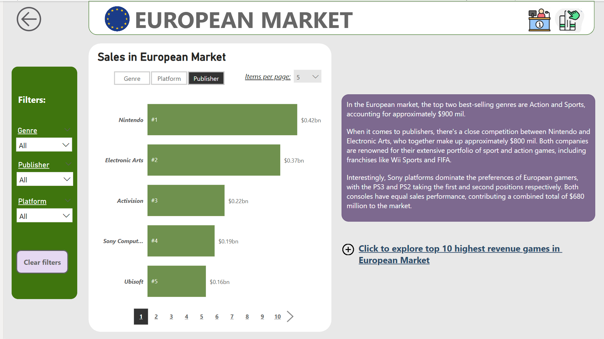
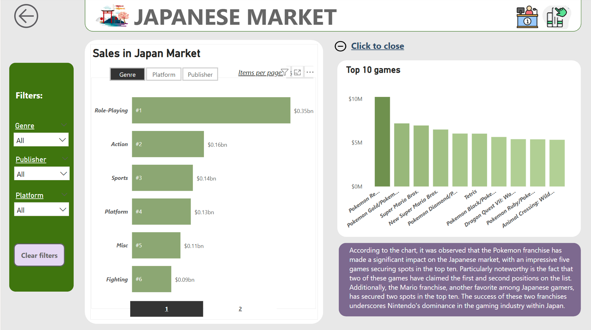
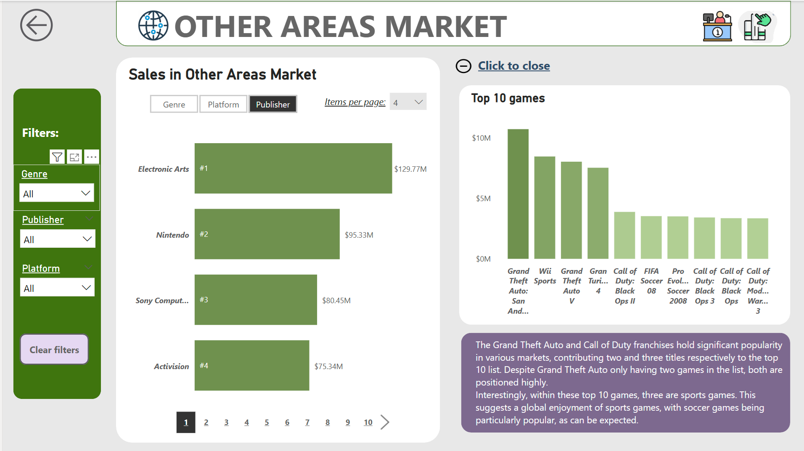
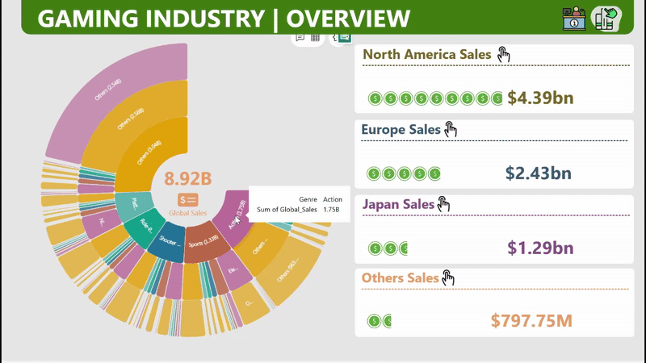
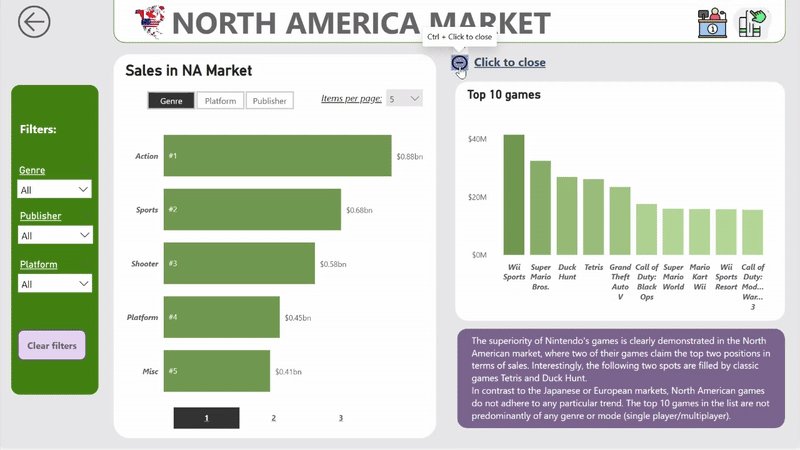
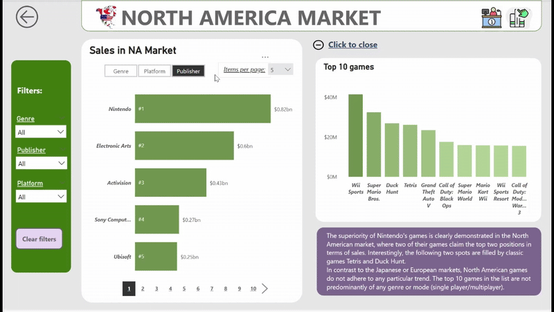
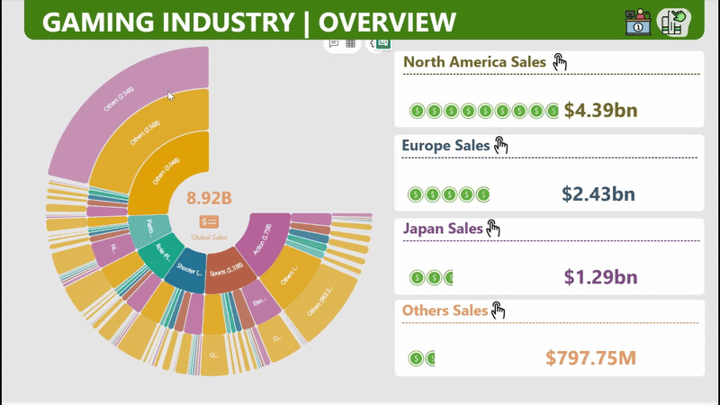

# 🎮 Video Game Sales Dashboard — Power BI Project

## **Project Overview**

This Power BI dashboard explores global video game sales data across platforms, publishers, and genres. It uncovers key patterns in regional performance, top-selling games, and market share by genre. The project demonstrates my skills in Power BI reporting, and interactivity features (slicers, bookmarks, pagination). Data used was extracting from file **vgsales** - csv file which was retrieved from [Kaggle website](https://www.kaggle.com/datasets/gregorut/videogamesales/data)

## 💡 Objectives
- Analyze video game sales by region, platform, and genre.
- Identify top-selling games and publishers in different markets.
- Track revenue contribution across North America, Europe, Japan, and Other regions.
- Build a report that is clean, interactive, and optimized for end-user exploration.

## **Data Understanding**

**vgsales** contains a list of video games with sales greater than 100,000 copies. It was generated by a scrape of [vgchartz.com](https://www.vgchartz.com/).

        1. Rank               Ranking of overall sales
        2. Name               The games name
        3. Platform           Platform of the games release (i.e. PC,PS4, etc.)
        4. Year               Year of the game's release
        5. Genre              Genre of the game
        6. Publisher          Publisher of the game
        7. NA_Sales           Sales in North America (in millions)           
        8. EU_Sales           Sales in Europe (in millions)
        9. JP_Sales           Sales in Japan (in millions)
        10.Other_Sales        Sales in the rest of the world (in millions)
        11.Global_Sales       Total worldwide sales.
The script to scrape the data is available at [github](https://github.com/GregorUT/vgchartzScrape).
It is based on BeautifulSoup using Python.

## 🔧 Tools & Skills Used
- **Power Query**: Data cleansing and transformation
- **DAX (Data Analysis Expressions)**: Custom KPIs, filters, and interactivity logic
- **Techniques**: Slicers, bookmarks, buttons, tooltips, and pagination

## 📌 Key Features
- 📈 Regional dashboards for NA, EU, JP, and Others with top games and sales breakdowns
- 🎯 Filter controls for Genre, Publisher, and Platform
- 🧭 Navigation pane for seamless experience across report pages
- 🔖 Bookmark buttons and pagination controls

## 📷 Screenshots & Interactive Features Demo

### Overview Page

### North America Market

### European Market

### Japanese Market

### Other Regions Market

### Filters and Slicers in Action

### Bookmark Navigation

### Pagination Logic

### Navigation System

📫 **Let’s Connect**  
This project is part of my data visualization portfolio. Feel free to explore, fork, or reach out with feedback or collaboration ideas!
